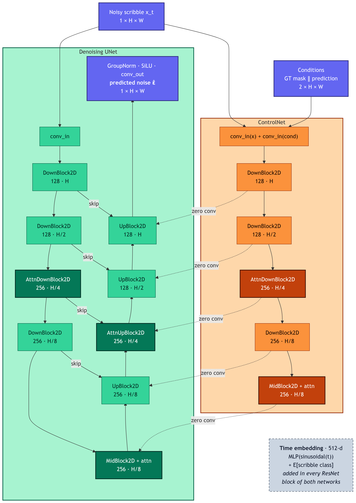

# Morphologically Dependent Interactive Scribble Generation

A diffusion-based deep learning approach for generating interactive scribbles for image segmentation tasks. This project implements a conditional diffusion model that learns to generate scribble annotations conditioned on ground truth segmentation masks and initial prediction masks.

## Overview

This project uses a diffusion probabilistic model to generate scribbles that can guide interactive segmentation corrections. The model is trained on:

- Ground truth segmentation masks
- Initial prediction masks (simulated or real)
- Target scribbles (morphologically generated or real human scribbles)

The model learns to generate appropriate scribbles that highlight regions where predictions differ from ground truth. It supports multiple scribble generation methods including contour-based, skeleton-based, and medial axis approaches.

## Web Interface

[scribble-diffusion-webapp](https://github.com/mtaal/scribble-diffusion-webapp) is a Streamlit app for trying out the model interactively. You draw or upload a ground-truth mask and a prediction mask, and the app generates a correction scribble using the ONNX export of this model.

## Relevant articles

- Adding Conditional Control to Text-to-Image Diffusion Models (https://arxiv.org/pdf/2302.05543)

## Features

- **Conditional Diffusion Model**: UNet-based architecture with ControlNet for scribble generation guided by segmentation masks
- **Multiple Scribble Types**: Generate human-like, contour-based, skeleton-based, and medial axis scribbles
- **Synthetic Training Data**: Automated generation of training pairs with Perlin noise augmentation
- **Region-Weighted Loss**: Configurable loss functions with higher weights for scribble regions and artifact areas
- **Experiment Tracking**: Integration with Weights & Biases
- **Accelerated Training**: Support for mixed precision and gradient accumulation
- **ONNX Deployment**: Export the denoiser to ONNX and run the full sampler with ONNX Runtime

## Installation

Tested with Python 3.12.

```bash
# Clone the repository
git clone https://github.com/mtaal/scribble-diffusion.git
cd scribble-diffusion

# Create virtual environment (recommended)
python -m venv .venv
source .venv/bin/activate  # On Windows: .venv\Scripts\activate

# Install dependencies (voxynth is installed from GitHub, so git is required)
pip install -r requirements.txt
```

## Quick Start

```bash
# 1. Train (set pathsToRealData and savePath in the config first, see "Training Data Format")
python -m src.train --config configs/default.json

# 2. Export a checkpoint to ONNX, using the same config it was trained with
python -m src.utils.saveAsOnnx \
  --config configs/default.json \
  --weights /workspace/results/checkpoint-0050/model.bin \
  --output model-definition/scribbleModel.onnx

# 3. Generate a scribble for a prediction/GT pair
python -m src.inference \
  --input path/to/predGt.png \
  --output path/to/result.png \
  --onnx model-definition/scribbleModel.onnx \
  --config configs/default.json \
  --scribble-class 1
```

## Project Structure

```
.
├── configs/                     # Training configurations
│   ├── default.json             # Full config, mirrors the defaults in configModels.py
│   └── *.json                   # Experiment configs (only the fields that differ from the defaults)
├── docs/                        # Architecture diagram (Mermaid source + rendered PNG)
├── src/
│   ├── configConstants.py       # Global constants (UPPER_CASE)
│   ├── configModels.py          # Pydantic configuration models
│   ├── train.py                 # Main training script
│   ├── inference.py             # ONNX inference (CLI and Python API)
│   ├── data/
│   │   ├── dataset.py           # ScribbleDataset implementation
│   │   ├── scribbles.py         # Morphological scribble generation
│   │   ├── syntheticScribbles.py # Synthetic shape generation
│   │   └── fidMetric.py         # Frechet Inception Distance metric
│   ├── models/
│   │   ├── diffusion.py              # DDPM diffusion process (loss, sampling)
│   │   ├── schedule.py               # Variance schedule shared by training and ONNX inference
│   │   ├── duUnetBlocks4.py          # 4-block UNet with custom blocks
│   │   └── duBlocks4ControlNet.py    # ControlNet implementation
│   └── utils/
│       ├── utils.py             # Training utilities (checkpoints, plotting, LR schedule)
│       ├── modelSummary.py      # Parameter counts / torchinfo summary
│       └── saveAsOnnx.py        # ONNX export
├── model-definition/            # Exported models and checkpoints (git-ignored)
├── assets/                      # Template images and resources
├── requirements.txt             # Python dependencies
└── LICENSE                      # MIT License
```

## Model Architecture



- **4-Block UNet** (`duUnetBlocks4.py`): Diffusers-based `UNet2DModel` with a ControlNet branch
  - Fixed 4-stage down/up layout with configurable `blockOutChannels`, `layersPerBlock` and `normNumGroups`
  - Attention in the third down/up block and in the mid block
  - Scribble class embedding added to the sinusoidal timestep embedding, used by every ResNet block
- **ControlNet** (`duBlocks4ControlNet.py`): takes the noisy scribble plus the GT and prediction masks
  and injects its features into the UNet decoder through zero-initialised convolutions

The model predicts the noise `ε̂` of a DDPM. The number of timesteps and the variance schedule
(`linear` or `cosine`) come from the config, and inference must use the same values.

The diagram is rendered from `docs/*.mmd` with `docs/render.mjs` (see the usage notes in that file).

## Training Data Format

Real training data is a set of RGB PNG files, found recursively under each directory in
`dataParams.pathsToRealData`. Each PNG encodes one sample in its channels:

| Channel | Content                            |
| ------- | ---------------------------------- |
| R       | Prediction mask (binary, 0 / 255)  |
| G       | Ground-truth mask (binary, 0 / 255) |
| B       | Scribble (binary, 0 / 255)         |

Training checks that every configured path exists and contains at least one PNG.
`valFraction` of the real images are held out for validation (deterministic split seeded by `seed`).

The real samples are mixed with synthetic samples (see `realProbability`). Synthetic samples need no data on disk:

1. **Human Scribbles**: Real user-provided scribbles from interactive segmentation sessions (the PNGs above)
2. **Contour Scribbles**: Synthetically generated along mask boundaries with Perlin noise augmentation
3. **Skeleton Scribbles**: Generated using morphological skeletonization of error regions
4. **Medial Axis Scribbles**: Generated using medial axis transform of masks

Fully synthetic samples are built from two independently drawn random shapes (GT and
prediction). The scribble is generated on the FP or FN region between them, and the class
label follows the region the scribble was finally drawn on. All data sources share
the same augmentation (crop, 50% flips, random rotation). Each transform's parameters are
sampled once per sample and applied identically to GT, prediction and scribble.
Synthetic validation samples are generated in `valMode` (no random skeleton breakage).

## Configuration

Training is configured with JSON files in `configs/`, validated by the Pydantic models in
`src/configModels.py`. A config file only needs the fields that differ from the defaults:
missing fields take the defaults defined in `configModels.py` (they are *not* merged with
`configs/default.json`, which simply lists all defaults explicitly). See `configs/small.json` for a
minimal example.

### Data Parameters (`dataParams`)

| Field | Default | Description |
| ----- | ------- | ----------- |
| `imageSize` | `{"width": 128, "height": 128}` | Target image size (must be square for export and inference) |
| `pathsToRealData` | `["/data"]` | Directories with real training PNGs |
| `valFraction` | `0.2` | Fraction of the real images held out for validation; `0` validates on training images |
| `realProbability` | `0.5` | Probability of drawing a real vs. a synthetic sample |
| `syntheticPerlinGeneratedProbability` | `0.0` | Probability of Perlin-noise augmentation for synthetic samples |
| `shape` | `any` | Synthetic shape filter (`any`, `circle`, `rectangle`, `triangle`) |

### Model Parameters (`modelParams`)

| Field | Default | Description |
| ----- | ------- | ----------- |
| `model` | `duUnet4Blocks` | Model architecture (currently only `duUnet4Blocks`) |
| `conditional` | `true` | Condition on GT and prediction masks through the ControlNet |
| `imageChannels` | `1` | Channels of the scribble sample (UNet in/out channels) |
| `blockOutChannels` | `[128, 128, 256, 256]` | Channels per UNet/ControlNet block (4 values) |
| `layersPerBlock` | `2` | ResNet layers per block |
| `normNumGroups` | `32` | GroupNorm groups; must divide every value in `blockOutChannels` |
| `nChannels` | `64` | Deprecated and unused (width comes from `blockOutChannels`) |

### Training Parameters (`trainParams`)

| Field | Default | Description |
| ----- | ------- | ----------- |
| `numEpochs` | `300` | Total training epochs |
| `batchSize` | `16` | Training batch size |
| `gradientAccumulationSteps` | `1` | Micro-batches per optimizer step |
| `numWorkers` | `4` | Dataloader workers |
| `learningRate` | `1e-4` | Peak learning rate (cosine decay) |
| `lrWarmupSteps` | `0` | Learning-rate warmup steps |
| `optimizer` | `AdamW` | `Adam` or `AdamW` |
| `clipNorm` | `-1` | Gradient clipping norm (`-1` disables) |
| `mixedPrecision` | `bf16` | Accelerate mixed precision mode (`no`, `fp16`, `bf16`) |
| `steps` | `50` | Number of diffusion timesteps (training samples `t` in `[1, steps]`) |
| `schedulerType` | `cosine` | Variance schedule (`linear` or `cosine`) |
| `schedulerArgs` | `{"beta1": 1e-4, "betaT": 0.2, "s": 0.008, "maxBeta": 0.999}` | `beta1`/`betaT` for linear, `s`/`maxBeta` for cosine |
| `loss` | `l2` | `l1` or `l2` |
| `lossClassWeights` | `1.0` / `1.0` | `targetRegionLossWeight` / `nonTargetRegionLossWeight` (see [Loss Function](#loss-function)) |
| `scribbleGauss` | `true` | Train on Gaussian-smoothed instead of binary scribbles |
| `savePath` | `/workspace/results` | Output directory for checkpoints and evaluation images |
| `logEvery` | `50` | Save a model checkpoint every N epochs (and after the last epoch) |
| `logNImages` | `2` | Number of validation batches evaluated and logged per epoch (despite the name) |
| `seed` | `42` | Random seed (also seeds the train/val split) |
| `logWandb` | `true` | Log to Weights & Biases |
| `wandbProject` | `diffusion-scribble-segmentation` | W&B project name |
| `wandbName` | config file name | W&B run name (a timestamp is appended) |
| `wandbNotes` | `Run notes` | W&B run notes |
| `evalScribbleClassOverride` | `null` | Force the scribble class during evaluation (`0`, `1`, or `null` for the batch class) |
| `evalSaveEveryNImages` | `1000` | Save evaluation plots every N images (`0` disables) |
| `evalSaveMode` | `stochastic` | `stochastic` (probability batchSize/N) or `deterministic` (exact N-image boundaries) |
| `valShuffle` | `true` | Shuffle the validation dataloader |

## Usage

### Training

```bash
python -m src.train --config configs/default.json
```

For multiple GPUs, launch through Accelerate:

```bash
accelerate launch -m src.train --config configs/default.json
```

With `logWandb: true`, run `wandb login` first, or set `logWandb` to `false`.

Training writes one folder per epoch to `savePath`:

```
<savePath>/
└── checkpoint-0050/
    ├── model.bin        # model weights (input for ONNX export)
    ├── optimizer.pt
    ├── scheduler.pt
    └── ...              # evaluation images of this epoch
```

The folders hold that epoch's evaluation images, but model weights are only saved every
`logEvery` epochs and after the final epoch. With the defaults, the first `model.bin` is in
`checkpoint-0050/`.

### ONNX Export

Export a trained checkpoint to ONNX. Run from the project root:

```bash
python -m src.utils.saveAsOnnx --config <training-config> --weights <model.bin> --output <model.onnx>
```

| Argument       | Default                               | Description                                                 |
| -------------- | ------------------------------------- | ----------------------------------------------------------- |
| `--config`     | `configs/default.json`                | Config the checkpoint was trained with (model shape and image size) |
| `--weights`    | `model-definition/model.bin`          | Model weights checkpoint (relative to project root, or absolute) |
| `--output`     | `model-definition/scribbleModel.onnx` | Output path for the ONNX model (relative to project root, or absolute) |
| `--model`      | `duUnet4Blocks`                       | Model architecture (`duUnet4Blocks`)                        |
| `--image-size` | _(from config)_                       | Optional image size override in pixels                      |
| `--no-test`    | _(flag)_                              | Skip the ONNX Runtime inference test after export           |
| `--allow-missing-keys` | _(flag)_                      | Export even if checkpoint keys do not match the config-built model |

The config has to match the checkpoint. If the model built from the config has missing or
unexpected keys compared to the checkpoint, the export aborts and lists them (for example
when `blockOutChannels` or `layersPerBlock` differ). After a successful export the model is
run once with ONNX Runtime to check that the inputs and outputs work.

Examples:

```bash
# Export a checkpoint of an experiment config
python -m src.utils.saveAsOnnx \
  --config configs/test-half-channels-1layer-1e5lr.json \
  --weights test-results/checkpoint-0299/model.bin \
  --output model-definition/scribbleModel.onnx

# Export at a higher resolution, without the post-export test
python -m src.utils.saveAsOnnx \
  --config configs/test.json \
  --weights test-results/checkpoint-0050/model.bin \
  --output model-definition/scribbleModel256.onnx \
  --image-size 256 \
  --no-test
```

#### ONNX model interface

The exported model is a **single denoising step**: it predicts the noise in `x` at timestep `t`.
Generating a scribble means running the DDPM reverse loop around it for `steps` iterations,
which `src/inference.py` does. To use the model from another runtime, port that loop and the
variance schedule in `src/models/schedule.py`.

| Name | Type | Shape | Description |
| ---- | ---- | ----- | ----------- |
| `x` (input) | float32 | `B × 1 × H × W` | Noisy scribble `x_t` (start from `N(0, 1)`) |
| `t` (input) | int64 | `1` | Timestep in `[1, steps]` |
| `conditionGt` (input) | float32 | `B × 1 × H × W` | Ground-truth mask in `[0, 1]` |
| `conditionPred` (input) | float32 | `B × 1 × H × W` | Prediction mask in `[0, 1]` |
| `scribbleClass` (input) | int64 | `B` | `0` = background scribble, `1` = foreground scribble |
| `output` | float32 | `B × 1 × H × W` | Predicted noise `ε̂` |

### Inference

Generate a scribble from the command line:

```bash
python -m src.inference \
  --input path/to/predGt.png \
  --output path/to/result.png \
  --onnx model-definition/scribbleModel.onnx \
  --config configs/default.json \
  --scribble-class 0
```

| Argument | Default | Description |
| -------- | ------- | ----------- |
| `--input` | _(required)_ | RGB PNG with R = prediction mask, G = ground-truth mask (B is ignored) |
| `--output` | _(required)_ | Output PNG: R = prediction, G = ground truth, B = generated scribble |
| `--scribble-class` | _(required)_ | `0` = background scribble (on false positives), `1` = foreground scribble (on the GT) |
| `--onnx` | `model-definition/scribbleModel.onnx` | Exported ONNX model |
| `--config` | _(defaults of `configs/default.json`)_ | Config the checkpoint was trained with (steps, schedule, image size) |
| `--threshold` | `0.5` | Binarisation threshold for the generated scribble |
| `--debug-dir` | _(none)_ | Directory for debug PNGs (conditions and clipped output) |

Paths are relative to the current directory. The input is resized to the model's image size
(nearest neighbour), so the output has that size as well. The command exits with code 1 if
generation fails.

Pass the config the checkpoint was trained with, so that the reverse process uses the
same number of steps and variance schedule as training.

The same functionality is available from Python:

```python
from src.inference import processImageFile

ok = processImageFile(
    inputPath="path/to/predGt.png",
    outputPath="path/to/result.png",
    onnxModelPath="model-definition/scribbleModel.onnx",
    scribbleClass=0,                      # 0 = background scribble, 1 = foreground scribble
    configPath="configs/default.json",    # config of the exported checkpoint
)
print("success" if ok else "failed")
```

### Model Summary

Print parameter counts and a torchinfo summary for a config-driven model:

```bash
python -m src.utils.modelSummary --config configs/default.json
python -m src.utils.modelSummary --config configs/small.json --depth 2
```

| Argument | Default | Description |
| -------- | ------- | ----------- |
| `--config` | `configs/default.json` | Config file (relative to project root) |
| `--device` | `cpu` | Device for the dummy forward pass |
| `--depth` | `3` | Depth of the torchinfo summary |

## Loss Function

The model uses class-aware target/non-target weighting for scribble generation via `lossClassWeights`:

- `targetRegionLossWeight`: Weight for the class-dependent target region
- `nonTargetRegionLossWeight`: Weight for all non-target regions

Target region mapping:

- **Foreground Scribble (class 1)**: target is `FN ∪ TP` (GT foreground)
- **Background Scribble (class 0)**: target is `FP` (prediction false positives)

The two regions are normalised independently (mean loss per region), so the balance is
not affected by pixel-count disparity. Timesteps are sampled in `[1, steps]`; `t = 0`
carries no noise and is excluded.

## Dependencies

Core dependencies:

- PyTorch 2.5.1, torchvision 0.20.1
- diffusers >= 0.30.0, accelerate >= 1.1.0
- onnx >= 1.16.0, onnxruntime >= 1.16.0
- torchmetrics[image] >= 1.0.0, torch-fidelity >= 0.3.0
- scikit-image 0.24.0, opencv-python 4.10.0.84, scipy 1.14.1
- pydantic >= 2.0.0, wandb >= 0.18.5, torchinfo >= 1.8.0
- [voxynth](https://github.com/dalcalab/voxynth) (installed from GitHub)

See `requirements.txt` for the complete list.

## Contributing

The code follows these conventions:

- **Variables & Functions**: `camelCase` (e.g., `batchSize`, `learningRate`, `trainEpoch`)
- **Constants**: `UPPER_CASE` (e.g., `TENSOR_NORMALIZATION_FACTOR`, `KEY_SCRIBBLE`)
- **Classes**: `PascalCase` (e.g., `Diffusion4BlocksUNet`, `ScribbleDataset`)
- **Library Parameters**: Keep the original format (e.g., `num_layers`, `in_channels` for PyTorch/diffusers APIs)
- **Section Banners**: Each major section is marked with `######` headers
- **Step Numbering**: Complex logic is broken into numbered steps with comments
- **Imports**: standard library, then third-party, then local modules
- **Docstrings**: NumPy style with Parameters, Returns and Notes sections

```python
######################################################################
# SECTION NAME
######################################################################

def functionName(param1: int, param2: str) -> tuple:
    """
    Brief description of function.

    Parameters
    ----------
    param1 : int
        Description of param1
    param2 : str
        Description of param2

    Returns
    -------
    tuple
        Description of return value
    """
    # Step 0 - Initialize variables
    resultValue = None

    # Step 1 - Process input
    intermediateValue = processData(param1)

    # Step 2 - Return result
    return (intermediateValue, param2)
```

## Citation

If you use this code in your research, please cite:

```bibtex
@software{morphological_scribble_generation,
  author = {Mody, Prerak and Taal, Martin},
  title = {Morphologically Dependent Interactive Scribble Generation},
  year = {2026},
  url = {https://github.com/mtaal/scribble-diffusion}
}
```

## License

This project is licensed under the [MIT License](LICENSE).

## Authors

- Prerak Mody
- Martin Taal

## Acknowledgments

This project uses:

- [voxynth](https://github.com/dalcalab/voxynth) for synthetic data generation
- [Diffusers](https://github.com/huggingface/diffusers) for diffusion model implementations
- [Weights & Biases](https://wandb.ai/) for experiment tracking
